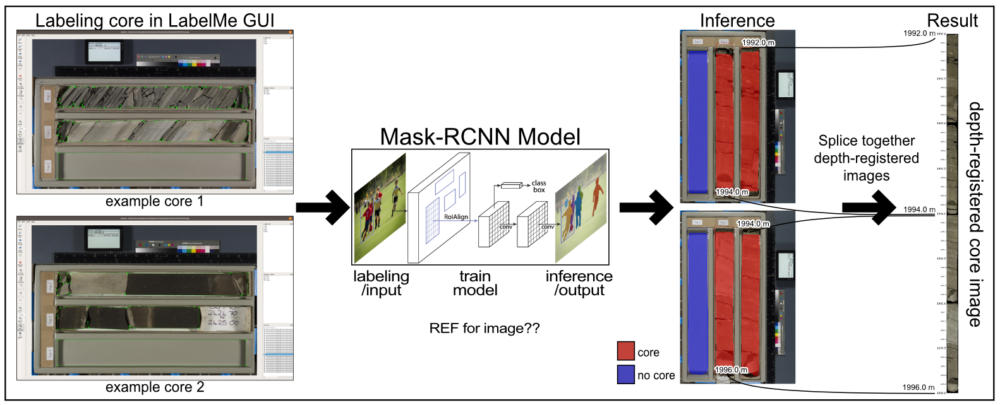

# Summary

Core samples -- cylindrical rock samples taken from subsurface boreholes -- are commonly used by Earth scientists to answer questions relating to geologic history and processes. Unlike other common sources of borehole data (*e.g.*, well logs), core is the only data that preserves true geologic scale and heterogeneity. A geologist will often describe the core by visual inspection and hand-draw a graphic log of the vertical changes in grain size and other rock properties. This description process is time consuming, subjective, and analog. The digitization and structuring of core image data allows for the development of automated and semi-automated workflows, which can in turn facilitate quantitative analysis of the hundreds of thousands of meters of core stored in public and private repositories around the world.

``corebreakout`` is a Python package for transforming raw images of geological core samples into structured datasets for analysis and modeling. It uses the Mask R-CNN algorithm [@He:2017], and is built around the open source TensorFlow and Keras implementation released by Matterport, Inc. [@Abdulla:2017].

## Workflow

We provide a labeled example dataset courtesy of the British Geological Survey, and make it straightforward for geologists to add their own training images, configure and train new models, and subsequently process their own image datasets. It supports standard core image layouts, and provides several methods for measuring and assigning depths to core sample columns, including by labeling arbitrary "measuring stick" objects.

## Functionality

In addition to the Python API, the source code includes scripts for training models, extracting meta-data from images with OCR, and processing directories of images with saved models. The segmentation functionality could be built into a GUI in the future, but that is beyond the current scope of the project.

``corebreakout`` is currently being utilized for ongoing work in image-based lithology modeling (Martin et al., 2019). The segmentation functionality was used to build a large image dataset for machine learning experiments, and the `CoreColumn` class provides a convenient API for retrieving, manipulating, and visualizing stored data. We also plan to release our modeling code, which uses this data structure to combine image data, sampled well log data, and interval labels into datasets for sequence modeling.

# Acknowledgements

We would like to acknowledge the contribution of open source subsurface core images from the British Geological Survey (https://bgs.ac.uk/), and financial support from Chevron through the Chevron Center of Research Excellence (https://core.mines.edu/).

# Citations

Citations to entries in paper.bib should be in
[rMarkdown](http://rmarkdown.rstudio.com/authoring_bibliographies_and_citations.html)
format.

For a quick reference, the following citation commands can be used:
- `@author:2001`  ->  "Author et al. (2001)"
- `[@author:2001]` -> "(Author et al., 2001)"
- `[@author1:2001; @author2:2001]` -> "(Author1 et al., 2001; Author2 et al., 2002)"

# References
